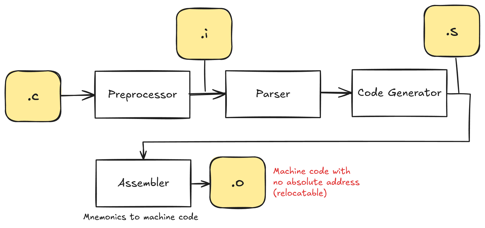
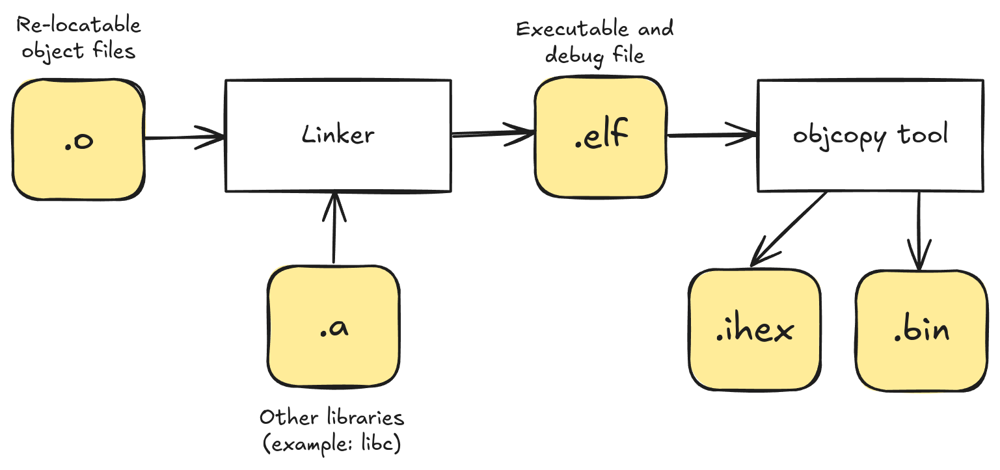
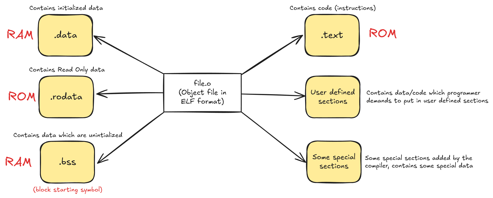
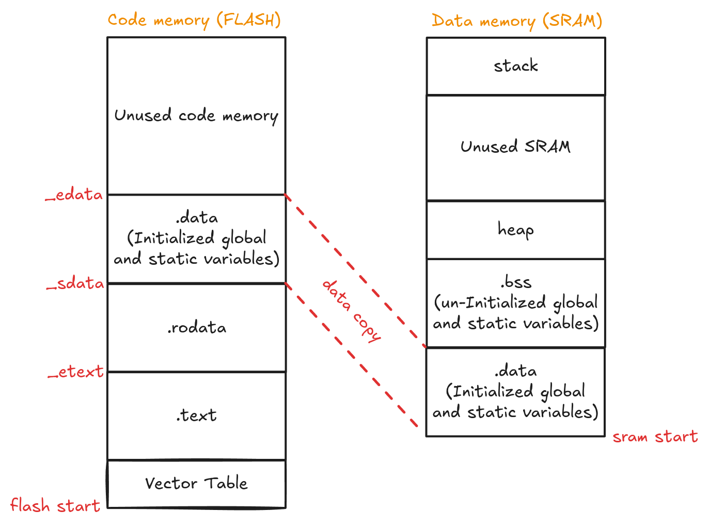

# LINKER 101

- **Cross Compilation:** Cross-compilation is a process in which the cross-toolchain runs on the host machine (PC) and creates executables that run on different machine(ARM)

- **Toolchains:**  is a collection of binaries which allows you to compile, assemble, link your applications. It also contains binaries to debug the application on the target. Toolchain also comes with other binaries which help you to analyze the executables.

GNU Tools (GCC) for ARM embedded processors is the best toolchain (it's free and open-source).

The important binaries:

- Compiler, linker, assembler: arm-none-eabi-gcc
- Elf file analyzer: arm-none-eabi-objdump, arm-none-eabi-readelf, arm-none-eabi-nm
- Assembler: arm-none-eabi-as
- Linker: arm-none-eabi-ld
- Format converter: arm-none-eabi-objcopy

## Build process

### High level 'c' code to machine codes



### Linking stage



in summary, it follows: Preprocessing -> Compilation -> Linking

## Compilation and compiler flags

Compile without link (`-c`): `arm-none-eabi-gcc -c -mcpu=cortex-m4 -mthumb main.c -o main.o`

If you would like to see assembly code, you could change the `-c` for `-S` and the `main.o` for `main.s`.

## Makefile

For automate the build process you should use a makefile like: [Makefile](app/Makefile)

### Some notes:

Dependency and Target:

    - `$^` - dependency
    - `$@` - target

```
main.o: main.c
    $(CC) $(CFLAGS) -o $@ $^
```

## Analyzing .o Files (Relocatable object files)

- file.o is in elf format (Executable and linkable format) 
- ELF is a standard file format for object files and executable files when you use GCC 
- A file format standard describes a way of organizing various elements(data, read-only data, code, uninitialized data, etc.) of a program in different sections.

To read object files, you can use `arm-none-eabi-objdump`

The `-h` display the content of the section headers, as example, you should run `arm-none-eabi-objdump -h file.o`.

To display the contents of all headers Display assembler contents of executable sections Display assembler contents of all sections, you should use `-d`, and you can redirect it to a file using `>` operator: `arm-none-eabi-objdump -d file.o > file_log`.
You also can use `-D` to get de assembler contents from all sections.

## Code and Data

- Instructions (codes) are stored in FLASH memory of the Microcontroller 
- Data (variables) are stored in main memory (RAM).



 ## Linker and Locator

 - Use the linker to merge similar sections of different object files and to resolve all undefined symbols of different object files. 
 - Locator (part of linker) takes the help of a linker script to understand how you wish to merge different sections and assigns mentioned addresses to different sections.


